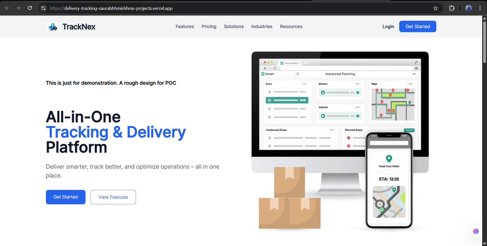
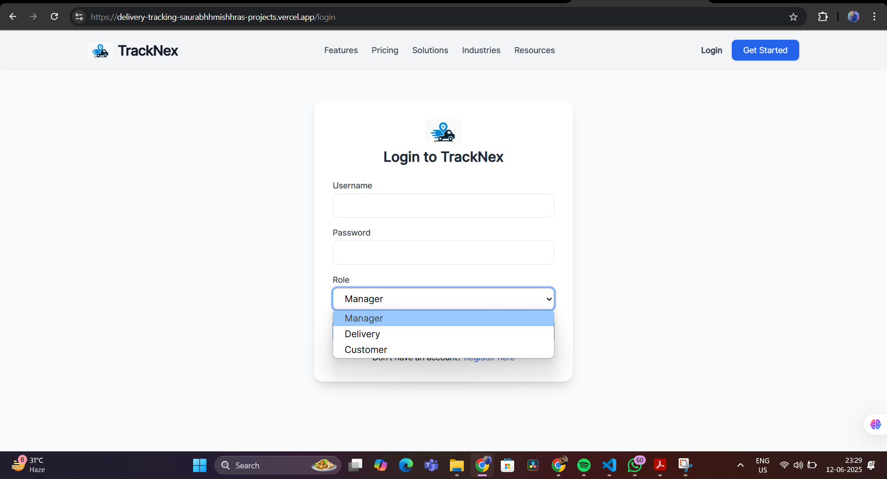
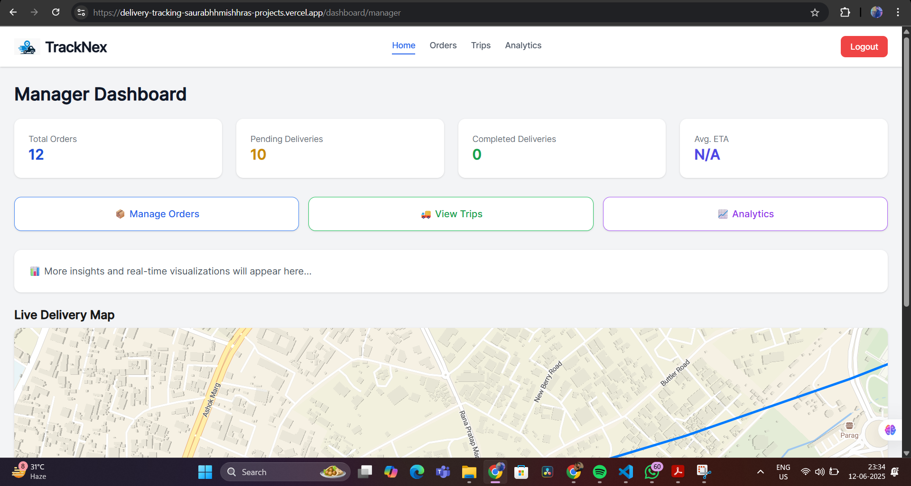
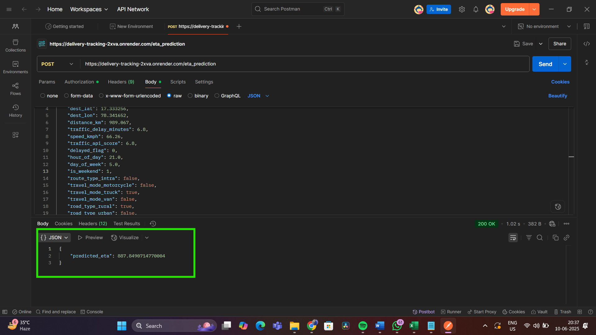
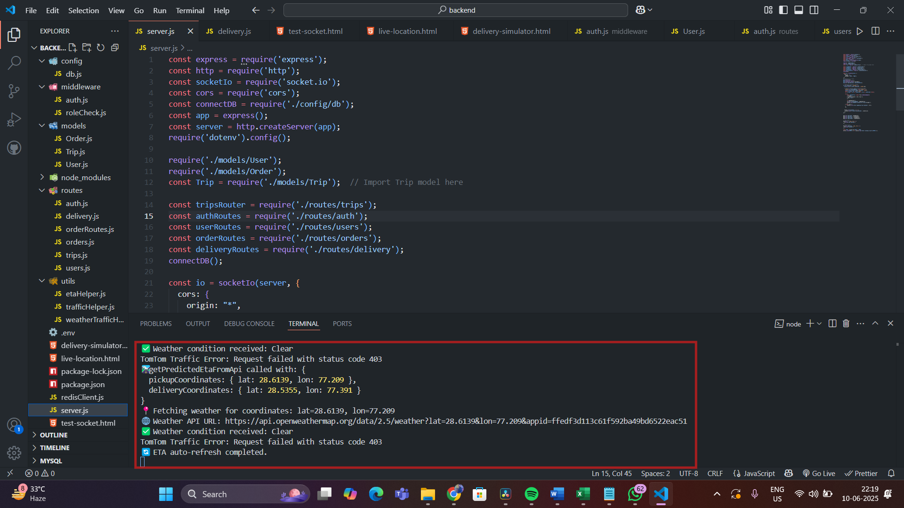

# TrackNex: Real-Time Delivery Tracking System

TrackNex is an AI-powered delivery tracking platform for customers, delivery agents, and logistics managers. It combines live order visibility, role-based dashboards, trip assignment, and ETA prediction in one full-stack logistics workspace.

Repository: https://github.com/ritesh-chauhan0x1/delivery-tracking.git

## Features

Completed:

- Real-time location tracking with Socket.io-powered delivery updates.
- AI-powered ETA prediction through a dedicated Python ML service.
- Role-based dashboards for customers, delivery agents, and managers.
- JWT authentication with manager, delivery, and customer roles.
- Order and trip management for creating, assigning, updating, and completing deliveries.
- Traffic and weather enrichment through external APIs.
- Modular frontend, backend, and ML service architecture.

In progress:

- Manager analytics and reporting.
- Ratings and feedback.
- Notification workflows.
- Route optimization enhancements.
- Mobile and desktop client expansion.

## Project Structure

```text
delivery-tracking/
  backend/     Node.js, Express, MongoDB, Redis, Socket.io
  frontend/    Next.js 15, React 19, Tailwind CSS, TypeScript
  ml_model/    Python FastAPI ETA prediction service
```

## Tech Stack

Frontend:

- Next.js 15 and React 19
- Tailwind CSS
- Framer Motion
- Lucide React
- Radix UI primitives
- Axios
- Maplibre GL

Backend:

- Node.js and Express
- MongoDB with Mongoose
- JWT and BcryptJS
- Socket.io
- Redis
- Axios

Machine learning:

- Python
- FastAPI
- Scikit-learn
- Pandas and NumPy
- Random Forest Regressor

## Screenshots







## Run Locally

Clone the repository:

```bash
git clone https://github.com/ritesh-chauhan0x1/delivery-tracking.git
cd delivery-tracking
```

Start the backend:

```bash
cd backend
npm install
node server.js
```

Create `backend/.env`:

```bash
MONGO_URI=your_mongodb_uri
JWT_SECRET=your_jwt_secret
REDIS_URL=your_redis_url
ML_API_URL=http://localhost:8000
```

Start the ML service:

```bash
cd ml_model
pip install -r requirements.txt
python ml_api.py
```

Start the frontend:

```bash
cd frontend
npm install
npm run dev
```

Create `frontend/.env.local`:

```bash
NEXT_PUBLIC_BACKEND_URL=http://localhost:5000
NEXT_PUBLIC_ML_API_URL=http://localhost:8000
```

Default local URLs:

- Frontend: http://localhost:3000
- Backend: http://localhost:5000
- ML model API: http://localhost:8000

## Environment Variables

Backend:

| Variable | Description |
| --- | --- |
| `MONGO_URI` | MongoDB connection string |
| `JWT_SECRET` | Secret used for JWT signing |
| `REDIS_URL` | Optional Redis connection string |
| `ML_API_URL` | ETA prediction service base URL |

Frontend:

| Variable | Description |
| --- | --- |
| `NEXT_PUBLIC_BACKEND_URL` | Backend API base URL |
| `NEXT_PUBLIC_ML_API_URL` | Public ML API URL when needed by frontend clients |

The application falls back to the existing deployed Render services when these variables are not provided.

## Deployment

The project is structured for separate deployments:

- Frontend: Vercel or any Next.js-compatible host.
- Backend: Render or any Node.js host.
- ML model API: Render or any Python/FastAPI host.

Use Ritesh Chauhan's repository as the source:

```bash
https://github.com/ritesh-chauhan0x1/delivery-tracking.git
```

Current fallback service URLs in code:

- Backend: https://delivery-tracking-backend-3mxb.onrender.com
- ML model API: https://delivery-tracking-2xva.onrender.com

## Roadmap

- Complete manager dashboard functionality for trips, ratings, live map, and ETA.
- Build functional customer and delivery agent dashboards.
- Add analytics and reporting.
- Add delay, weather, dispatch, and delivery notifications.
- Add route optimization powered by ML.
- Explore React Native mobile applications for customers, agents, and managers.

## Author

**Ritesh Chauhan**

- Email: rites.chauhan11@gmail.com
- GitHub: https://github.com/ritesh-chauhan0x1

## Acknowledgements

- OpenAI and ChatGPT for dataset generation and architecture support.
- TomTom and OpenWeather APIs for route and environmental enrichment.
- Vercel and Render for deployment support.

## Contributing

Contributions are welcome.

1. Fork the repository.
2. Create a branch: `git checkout -b feature/your-feature-name`
3. Commit your changes: `git commit -m "Add feature"`
4. Push your branch: `git push origin feature/your-feature-name`
5. Open a pull request.

## License

This project is licensed under the MIT License. See [LICENSE.txt](./LICENSE.txt) for details.
